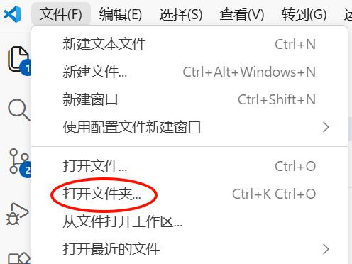
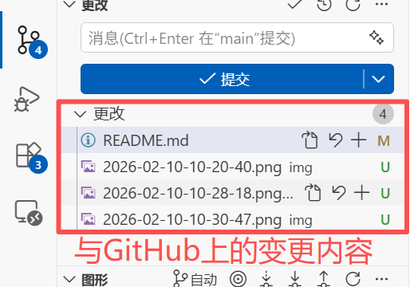
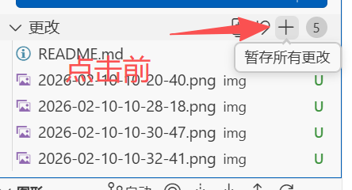
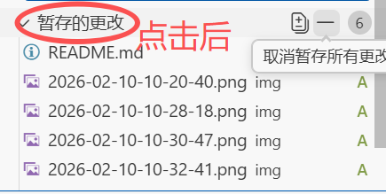
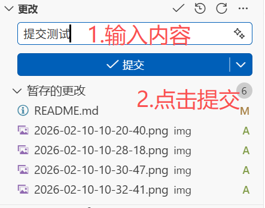
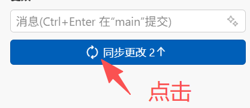
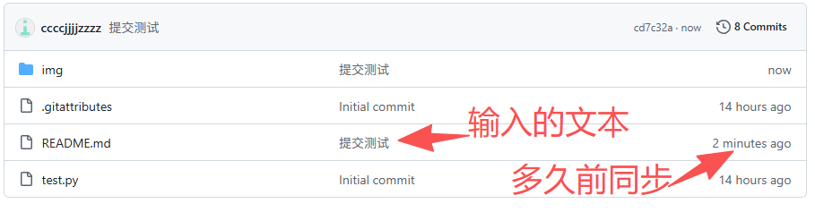

# git-vscode-md
## vs code登录GitHub账号
  

在vs code左下角账户点击登录GitHub账户  

## 上传项目到github
下载使用github desktop
  
这里已add an existing repository from your local drive为例（创建新的仓库同理）  

  
登录网页GitHub，可以看到仓库已上传  
  
## vs code打开项目并把修改内容同步到Github
打开本地项目文件夹，选择一个文件使用vs code打开  
  
或者在vs code左上角的**文件** -> **打开文件夹**也能打开项目  
  
修改完成代码后并ctrl+s保存后，左边源代码管理器会显示更改数字  
  
点击进入源代码管理器更改栏目显示变更内容  
  
点击更改旁边的+号，暂存所有更改，点击后原本的更改变为**暂存的更改**  

  
在提交上方消息处输入文字，一般为本次更改升级的内容等，然后点击提交  
  
点击提交后变为**同步更改**，点击同步更改，此时会把更改的内容上传到GitHub（**注意：这一步的操作可能会因为网络原因失败，多提交几次，或用其它加速器尝试**）  
  
可以登录GitHub看到项目内容已经跟本地同步  

