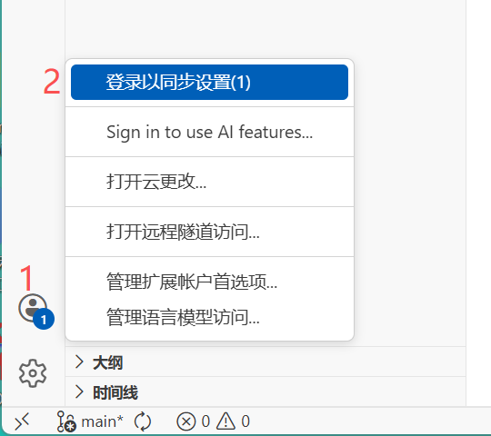
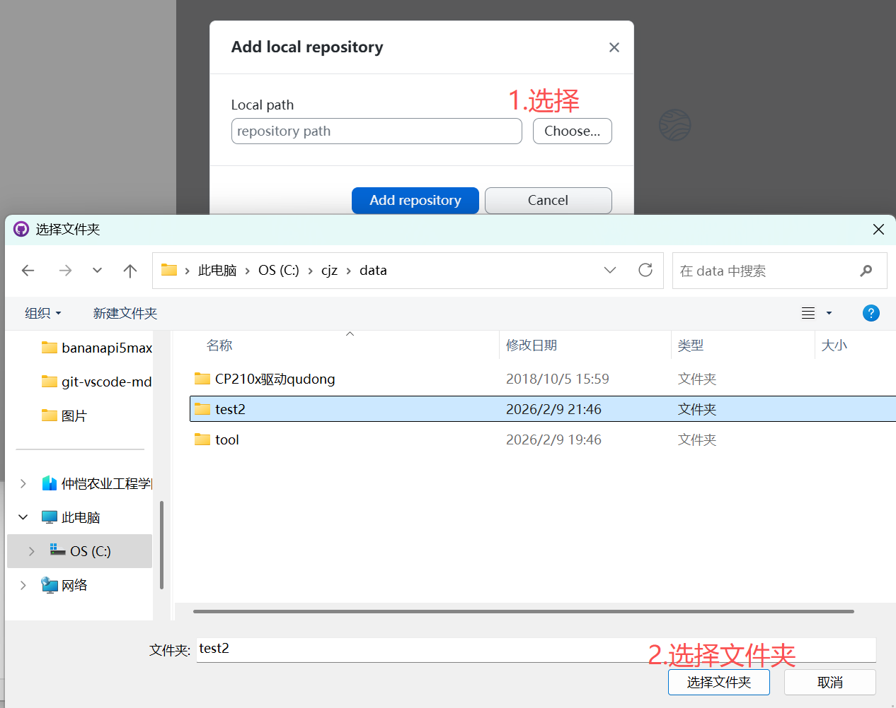
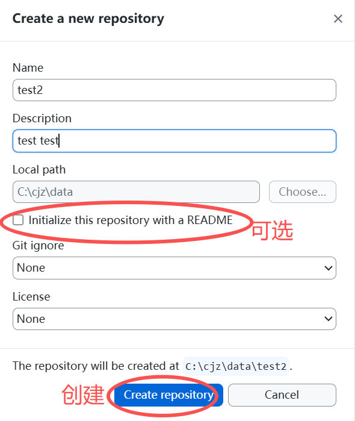
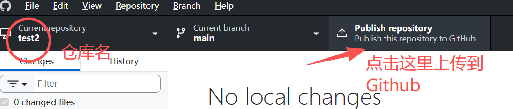
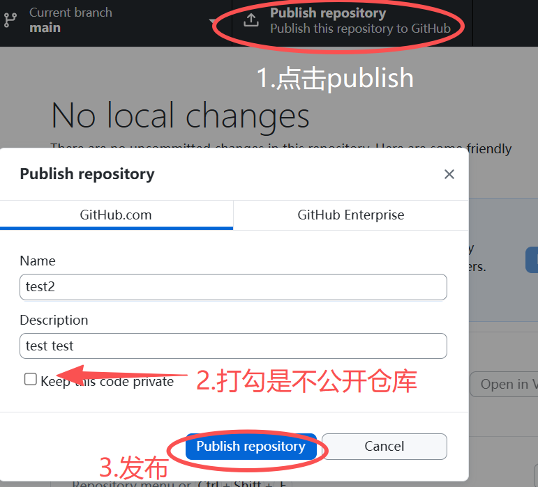
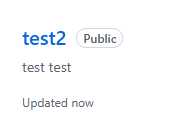

# git-vscode-md
## vs code登录GitHub账号
  

在vs code左下角账户点击登录GitHub账户  

## 上传项目到github
下载使用github desktop
  
这里已add an existing repository from your local drive为例（创建新的仓库同理）  

  
登录网页GitHub，可以看到仓库已上传  
