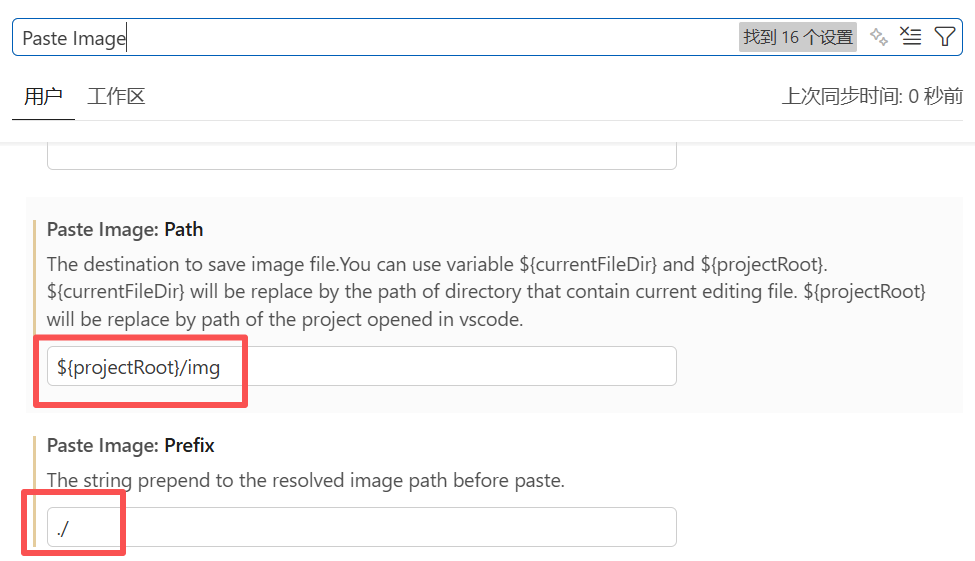

参考：https://markdown.com.cn/basic-syntax/paragraphs.html
# 标题
要创建标题，请在单词或短语前面添加井号 (#) 。# 的数量代表了标题的级别。例如，添加三个 # 表示创建一个三级标题  
# Heading level 1
## Heading level 2

# Markdown换行语法
在一行的末尾添加**两个或多个空格，然后按回车键**,即可创建一个换行  

# Markdown 强调语法
要加粗文本，请在单词或短语的前后各添加两个星号
I just love **bold text**.

# 列表语法
要创建有序列表，请在每个列表项前添加数字并紧跟一个英文句点
1. First item
2. Second item
3. Third item
4. Fourth item

# 围栏代码块
```json
{
  "firstName": "John",
  "lastName": "Smith",
  "age": 25
}
```


```python
print("hello")
```

# 图片截图
**paste image配置**
1.vs code安装paste image插件，方便粘贴图片  
2.打开 VS Code 设置，快捷键 Ctrl+,找到 Paste Image:  
  
**paste image粘贴图片**  
截图后，**用快捷键 Ctrl+Alt+V**粘贴图片，图片就会保存在项目的img文件夹内，这样子图片就不会保存在最外层根目录
