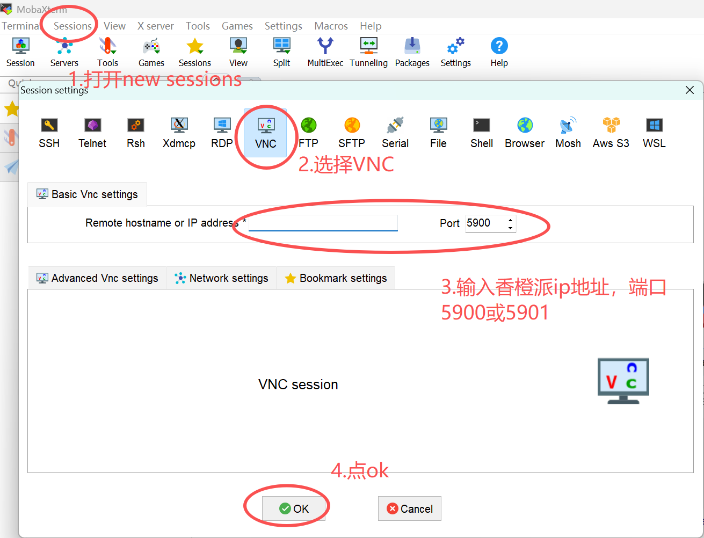
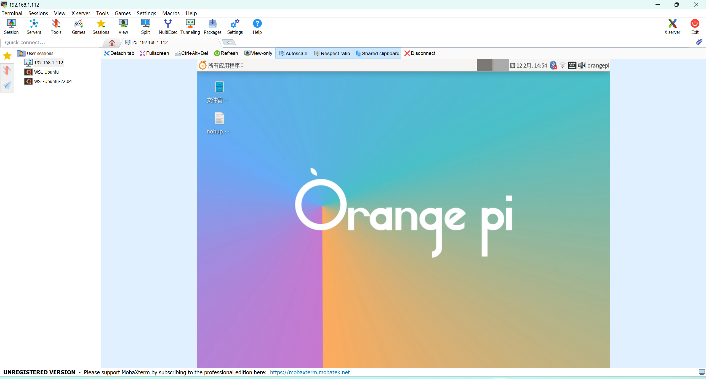

# 香橙派5 max远程桌面设置
用 x11vnc 共享物理桌面
## 1. 先清理之前的 TigerVNC 残留（可选但建议）
```bash
# 停止所有TigerVNC会话
vncserver -kill :1
# 卸载TigerVNC（避免冲突）
sudo apt remove -y tigervnc-standalone-server
```
## 2. 安装 x11vnc（香橙派适配版）
```bash
sudo apt update && sudo apt install -y x11vnc
```

## 3. 设置 VNC 密码
```bash
x11vnc -storepasswd
# 按提示输入密码（比如123456），按回车确认，选默认路径保存
```

## 4. 启动 x11vnc 服务（共享物理桌面，关键！）
```bash
# 启动服务，绑定5900端口（香橙派物理桌面默认:0）
x11vnc -usepw -display :0 -forever -shared
```

## 5. 设置用户级桌面自启应用
### 1).创建自启配置文件：
```bash
gedit ~/.config/autostart/x11vnc.desktop
```

### 2). 粘贴以下内容（直接复制，无需修改）：
```ini
[Desktop Entry]
Type=Application
Name=x11vnc
Exec=/usr/bin/x11vnc -auth guess -usepw -display :0 -forever -shared -noxdamage
Hidden=false
NoDisplay=false
X-GNOME-Autostart-enabled=true
X-KDE-Autostart-enabled=true
X-MATE-Autostart-enabled=true
```
### 3). 保存退出，赋予执行权限：
```bash
chmod +x ~/.config/autostart/x11vnc.desktop
```
### 4). 重启
```bash
sudo reboot
```

## 6. windows端远程连接
下载使用MobaXterm，或其它VNC工具  
点击左上角Sessions->New Sessions->VNC  
输入香橙派ip地址  

点击ok后输入步骤3设置的密码，即可远程连接  

