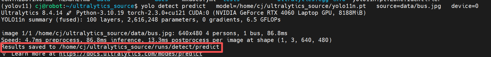
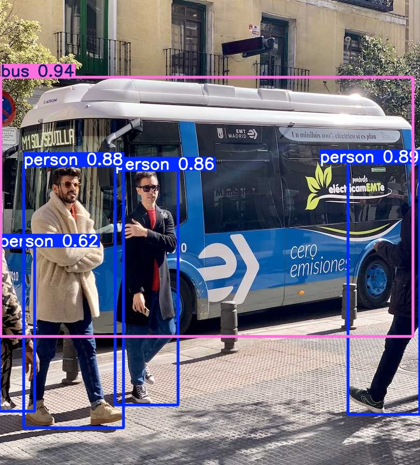

# 香橙派安装运行yolo v11
## 一、 WSL2 Ubuntu 22.04环境配置
需要在笔记本或台式电脑端安装WSL2的Ubuntu22.04，Ubuntu内安装anaconda  
### 1. 前置检查（确认 WSL2 能识别 NVIDIA 显卡）  
```bash
# 检查NVIDIA显卡是否被识别
nvidia-smi
```
* 正常输出：会显示显卡信息，且右上角标注CUDA Version: 12.7（对应你的驱动版本）。  
* 异常处理：若提示command not found，说明 WSL2 的 NVIDIA 组件未安装，先执行：  
```bash
sudo apt update && sudo apt install -y nvidia-driver-550
```   
安装完成后重启 WSL2（关闭终端，重新打开即可）。  
### 2. 用 Anaconda 创建专属虚拟环境
```bash
# 1. 更新conda（可选，建议执行）
conda update -n base -c defaults conda -y

# 2. 创建名为yolov11的虚拟环境，指定Python 3.10
conda create -n yolov11 python=3.10 -y

# 3. 激活该环境（后续所有操作都在这个环境中执行）
conda activate yolov11
```
### 3. 步骤 3：安装 CUDA Toolkit 12.1（WSL2 专用版本）
WSL2 中无需安装显卡驱动，只需安装 CUDA Toolkit 开发包，执行以下命令：
```bash
# 1. 添加NVIDIA官方源
wget https://developer.download.nvidia.com/compute/cuda/repos/wsl-ubuntu/x86_64/cuda-keyring_1.1-1_all.deb
sudo dpkg -i cuda-keyring_1.1-1_all.deb
sudo apt update

# 2. 安装CUDA Toolkit 12.1（仅安装开发包，不装驱动）
sudo apt install -y cuda-12-1

# 3. 配置CUDA环境变量（临时生效，关闭终端后需重新执行，或写入配置文件）
export PATH=/usr/local/cuda-12.1/bin:$PATH
export LD_LIBRARY_PATH=/usr/local/cuda-12.1/lib64:$LD_LIBRARY_PATH

# 4. 永久配置环境变量（推荐，避免每次重启终端重新配置）
echo -e "\n# CUDA 12.1环境变量" >> ~/.bashrc
echo "export PATH=/usr/local/cuda-12.1/bin:\$PATH" >> ~/.bashrc
echo "export LD_LIBRARY_PATH=/usr/local/cuda-12.1/lib64:\$LD_LIBRARY_PATH" >> ~/.bashrc

# 5. 生效环境变量
source ~/.bashrc

# 6. 验证CUDA Toolkit安装成功
nvcc -V
```
正常输出：会显示Cuda compilation tools, release 12.1, V12.1.105（版本号匹配即可）。  
### 4. 安装 PyTorch + TorchVision（CUDA 12.1 版本）
**上一步source会把python环境回到base，务必在激活的 yolov11 conda 环境中执行**  
```bash
conda activate yolov11

# 安装PyTorch 2.3.0+cu121和配套的TorchVision
pip3 install torch==2.3.0+cu121 torchvision==0.18.0+cu121 --index-url https://download.pytorch.org/whl/cu121

# 验证PyTorch是否识别CUDA
python -c "import torch; print(torch.cuda.is_available()); print(torch.version.cuda)"
```
### 5. 下载YOLOv11源码 （源码安装）
推荐浏览器登录ultralytics的GitHub下载源码，放到Ubuntu22.04的~/内，再执行解压安装  
https://github.com/ultralytics/ultralytics/archive/refs/heads/main.zip，下载后拖到 WSL2 的~/目录  
```bash
# 1. 下载源码
# 2. 解压到指定目录（即~/ultralytics_source）
unzip ~/ultralytics-main.zip -d ~/

# 3. 重命名解压后的文件夹（统一命名，方便后续安装）
mv ~/ultralytics-main ~/ultralytics_source

# 4. 删除压缩包（可选，节省空间）
rm ~/ultralytics-main.zip
```
### 6. 源码安装
获取源码后，按之前的步骤以可编辑模式安装：  
```bash
# 进入源码目录
cd ~/ultralytics_source

# 可编辑模式安装（修改源码立即生效）
pip install -e .

# 验证安装成功（显示Editable project location指向源码目录）
pip show ultralytics
```
### 7. 运行程序，测试是否正常
https://docs.ultralytics.com/zh/models/yolo11/#performance-metrics 下载yolo11n模型，并保存到ubuntu的~/ultralytics_source/目录下  
```bash
# 下载测试图片到源码目录下的data文件夹
mkdir -p data && wget -O data/bus.jpg https://ultralytics.com/images/bus.jpg

# 用绝对路径运行推理命令
yolo detect predict \
  model=/home/cj/ultralytics_source/yolo11n.pt \
  source=data/bus.jpg \
  device=0
```
运行成功后如下图  
  
打开目录/ultralytics_source/runs/detect/predict，即可查看识别效果  
  
